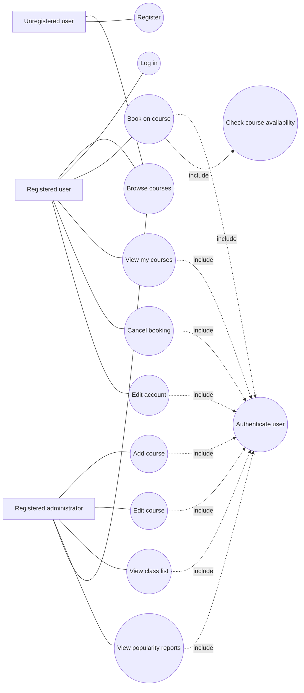
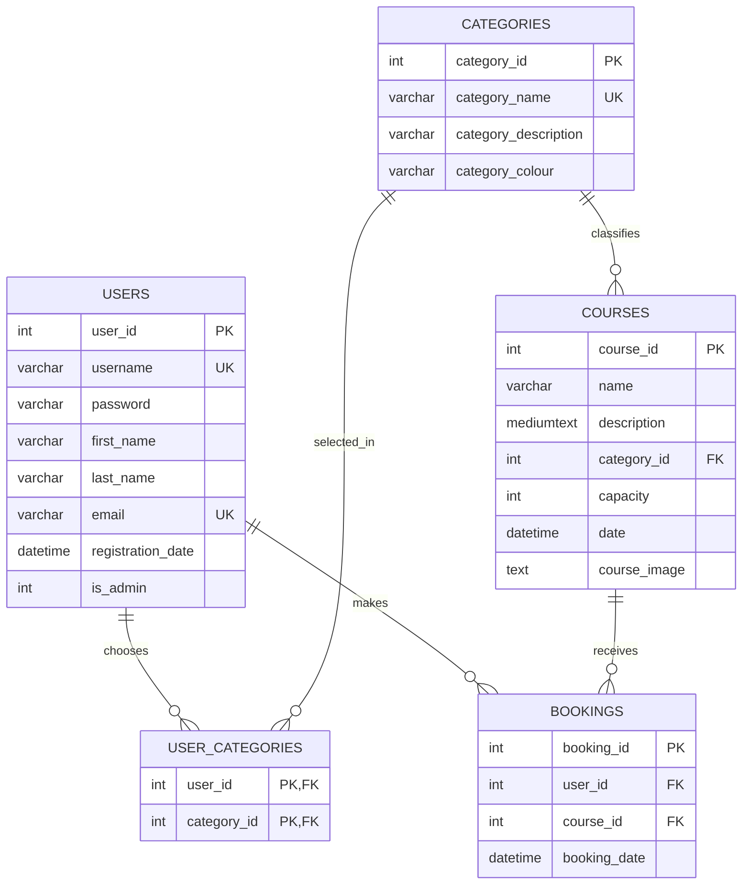

# UML and ERD

## Use case diagram

## Entity relationship diagram

## Relationship notes

- One user can make many bookings; each booking belongs to one user.
- One course can have many bookings; each booking belongs to one course.
- One category can contain many courses; each course belongs to one category.
- Users and categories have a many-to-many relationship implemented by `user_categories`.
- Duplicate bookings are prevented by the unique key on `(user_id, course_id)`.
- Duplicate usernames and duplicate emails are prevented by unique keys on `users`.
