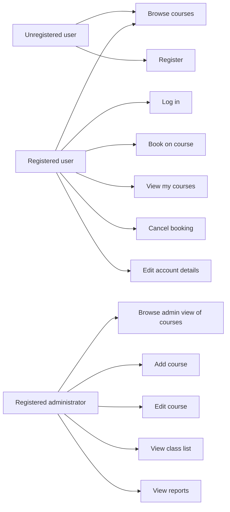

# Course Pal Project Documentation

## Source Requirements

The project follows the Ada Computer Science Course Pal brief. It is a full systems lifecycle project for a PHP/MySQL website with 14 PHP webpages, five SQL database tables, session variables, external CSS with media queries, testing, and evaluation.

## Analysis

Course Pal is a technology training company that runs courses on programming, software and web development, networking, cybersecurity, cloud computing, data science, graphic design, and mobile development. The website advertises courses and lets customers browse, register, log in, book courses, view bookings, and cancel bookings. Administrators manage courses and view reports.

### Functional Requirements

| ID | Requirement |
| --- | --- |
| 1.1 | New users can register for an account. |
| 1.1.1 | The registration form includes first name, last name, username, password, password verification, email address, and preferred category checkboxes. |
| 1.1.3 | Registration fields are validated before submission. |
| 1.1.3.1 | Duplicate usernames are rejected. |
| 1.1.4 | Successful registration adds a new user record. |
| 1.1.5 | Passwords are hashed before storage. |
| 1.2 | Registered users can log in using username and password. |
| 1.3 | Session variables store the user ID and username after login. |
| 1.4 | Authenticated users see All Courses, Home, My Account, and Logout. |
| 1.5 | Registered users can edit first name, last name, username, password, email, and preferred categories. |
| 2.3 | The home page displays introductory text and eight recommended courses. |
| 2.4 | Each course page displays image, title, description, date/time, capacity, current bookings, and booking button. |
| 3.1 | All Courses displays courses sorted by date by default. |
| 3.4 | All Courses includes a search box. |
| 3.6 | All Courses includes sortable headings: ID, Category, Course Name, Description, Date. |
| 4.1 | Users must be logged in to make a successful booking. |
| 4.3 | Full courses cannot be booked. |
| 4.4 | Users cannot book the same course twice. |
| 4.7 | Users can cancel bookings. |
| 5.1 | Admin users see All Courses, Home, My Account, Logout, Admin, and Reports. |
| 5.3 | Admin users can edit course name, description, date, category, capacity, and image. |
| 5.4 | Admin users can add new courses with those same fields. |
| 5.5 | Admin users can view a printable class list with user IDs, names, email addresses, and booking dates. |
| 5.6 | Admin users can view a visual report of popular courses sorted by booking number with category colours. |
| 6.1 | Media queries provide different layouts below and above 600px. |
| 6.2 | External CSS is used. |
| 6.3 | Pages use semantic HTML, alt text, and proper headings. |

## Design

### PHP Pages

The implementation contains exactly 14 top-level PHP pages:

1. `index.php`
2. `register.php`
3. `logout.php`
4. `courses.php`
5. `course.php`
6. `book.php`
7. `account.php`
8. `update_account.php`
9. `cancel_booking.php`
10. `admin.php`
11. `edit_course.php`
12. `delete_course.php`
13. `class-list.php`
14. `reports.php`

### Shared Files

- `includes/header.php`: shared header and session-aware navigation.
- `includes/footer.php`: shared footer.
- `includes/db.php`: PDO database connection.
- `includes/auth.php`: login and administrator guards.
- `includes/course_helpers.php`: reusable course and category helpers.

### Database Tables

The database contains the five tables specified by the brief.

| Table | Purpose | Fields |
| --- | --- | --- |
| `courses` | Stores course information. | `course_id`, `name`, `description`, `category_id`, `capacity`, `date`, `course_image` |
| `users` | Stores registered users. | `user_id`, `username`, `password`, `first_name`, `last_name`, `email`, `is_admin` |
| `bookings` | Links users to booked courses. | `booking_id`, `user_id`, `course_id`, `booking_date` |
| `categories` | Stores course categories. | `category_id`, `category_name` |
| `user_categories` | Links users to preferred categories. | `user_id`, `category_id` |

### Use Case Diagram

### Recommendation Algorithm

1. Collect preferred categories from `user_categories`.
2. Collect courses already booked by the user.
3. Select courses running in the next three months.
4. Exclude courses that are full.
5. Exclude courses the user has already booked.
6. Put courses from preferred categories first.
7. Sort preferred and other courses by start date.
8. Display the first eight courses on the home page.

## Testing Plan

| Test | Expected result | Evidence |
| --- | --- | --- |
| Import `database.sql` | Five required tables exist. | MySQL shows `bookings`, `categories`, `courses`, `user_categories`, `users`. |
| Lint PHP files | No syntax errors. | `php -l` passed on all PHP files and includes. |
| Count PHP pages | 14 top-level PHP pages. | `find . -maxdepth 1 -name '*.php' | wc -l` returned 14. |
| Home page | Intro text and Featured Courses appear. | Runtime check found `Welcome to Course Pal` and `Featured Courses`. |
| Register valid user | Account is created. | Runtime POST returned `Account created`. |
| Login valid user | User is redirected to account page. | Runtime POST returned `302 Location: account.php`. |
| Search for Python | Python course appears. | Runtime check found `Introduction to Python`. |
| Course detail | Date, capacity, bookings, and button appear. | Runtime check found `Capacity`, `Current bookings`, and `Book on course`. |
| Book a course | Booking is inserted and confirmation appears. | Runtime POST returned `Booking successful`. |
| Book same course twice | Second booking is rejected. | Runtime POST returned `already booked`. |
| Account page | Booked course appears with Cancel button. | Runtime check found booked course and cancel link. |
| Admin page | Course admin table and class list links appear. | Runtime check found `Course Admin` and `Class list`. |
| Class list | User ID/name/email/booking date table appears. | Runtime check found class list headings. |
| Reports | Visual chart and popular course table appear. | Runtime check found report page and `progress` elements. |

## Evaluation

The solution now follows the Course Pal brief closely: it uses the required five database tables, includes the required user registration fields, stores preferred categories, uses session variables, shows eight recommended courses, provides search and sorting on All Courses, displays date/capacity/bookings on course pages, prevents full or duplicate bookings, includes admin course management, provides class lists, and shows visual reports. It also uses external CSS and responsive media queries.

Remaining possible improvements match the evaluation suggestions from the brief: add multiple sessions per course, add administrator role management, add payment integration, and improve image upload/cropping.
